# Using Storyboard References for Embedded Views on MacOS

Setting up and using Storyboard References in Xcode for Mac OS is unintuitive, and it took me a while to figure it out.

Here are the steps necessary to properly set up and use Storyboard References so that you can define and embed view controller storyboard references so that you can reuse them in multiple places.

**IMPORTANT NOTE:** Storyboard references require a deployment target of MacOS 10.10.

1. Create a Storyboard for reusable view controller.
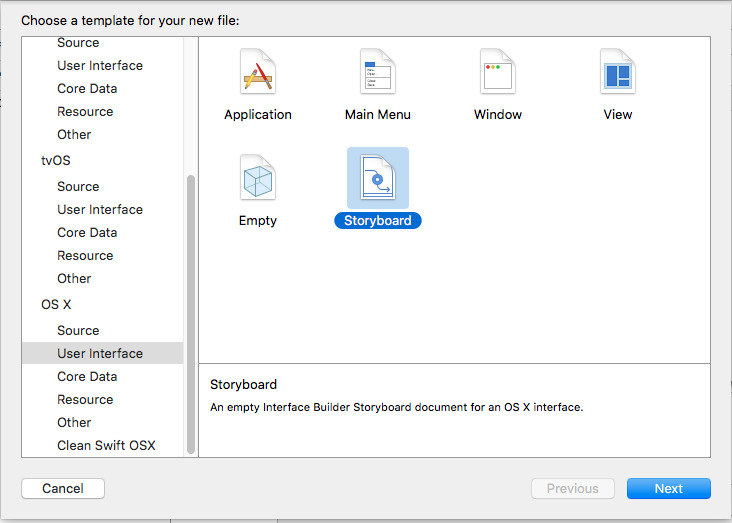
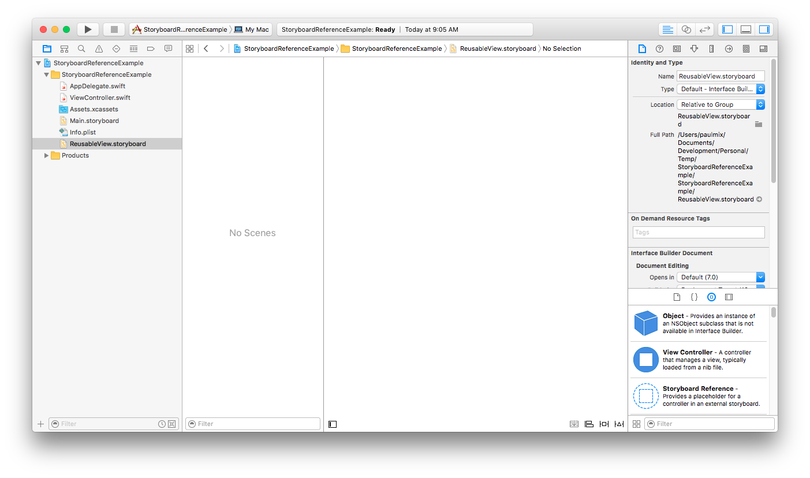
2. Create a view controller class for the view.
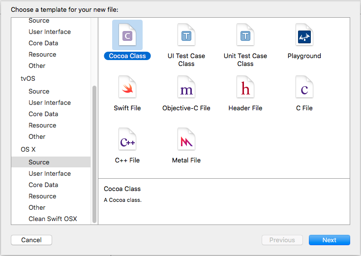
a. Make sure "Also create XiB file" is unchecked (as the interface will be defined by the storyboard you just created).
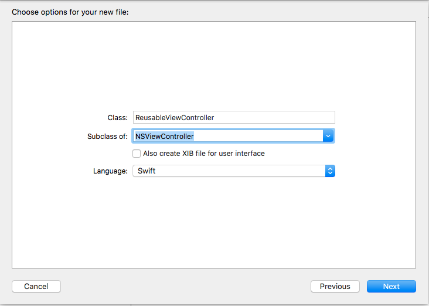
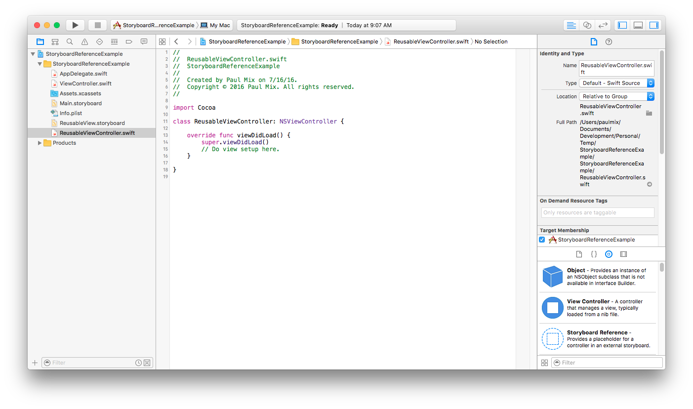
3. Configure the reusable view storyboard by adding a View Controller from the Library.
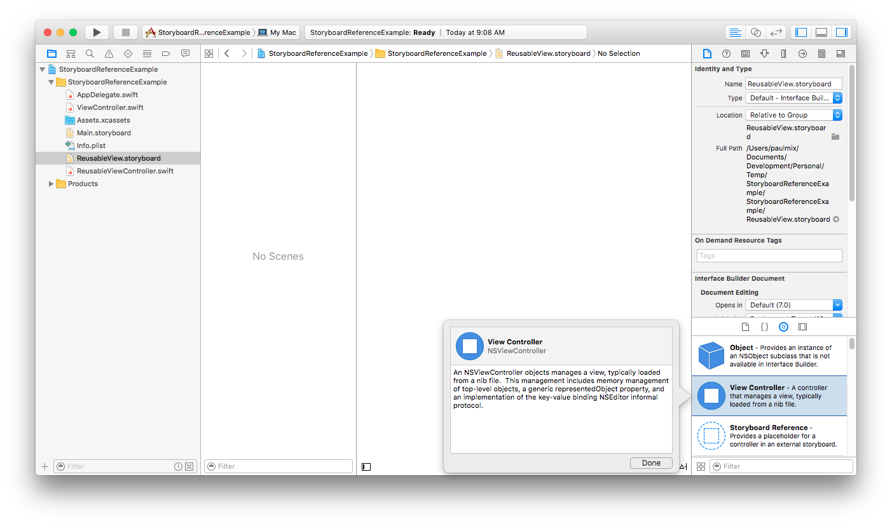
a. In the Identity Inspector, set the Custom Class of the view controller to the one you just created.
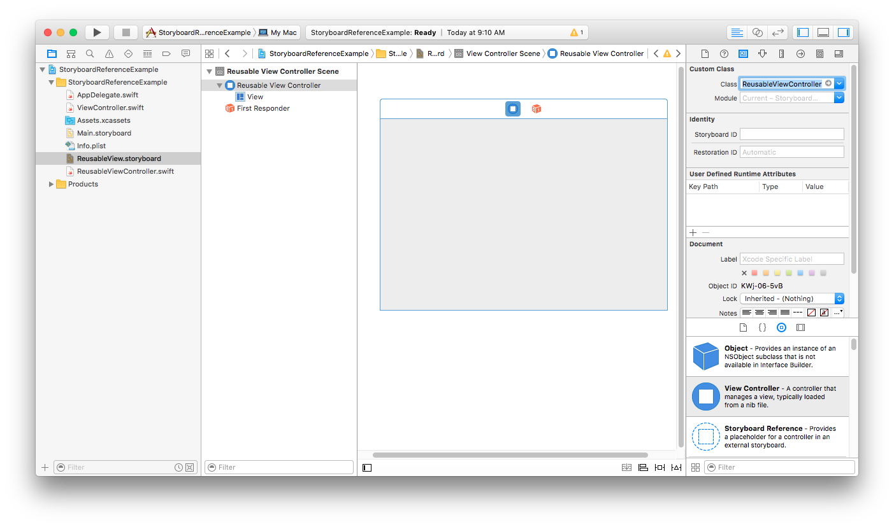
b. Add desired controls and define constraints in the reusable view. Note the size of the view.
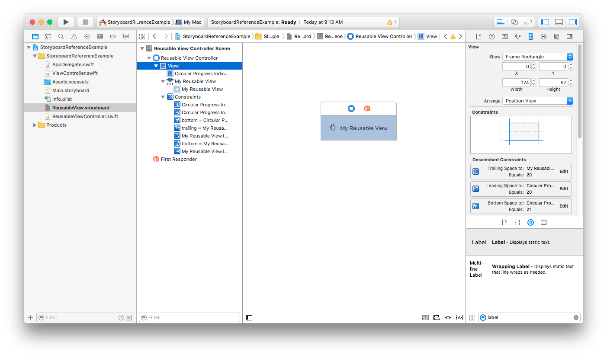
c. Specify a Storyboard ID for the reusable view controller.
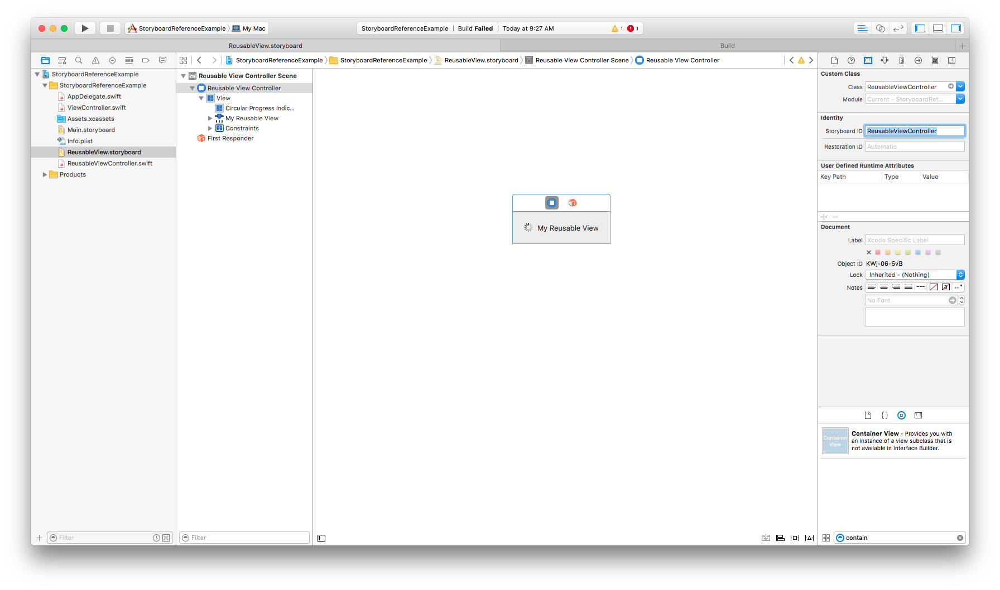
d. Make sure "Is Initial View Controller" is checked for the reusable view controller scene.
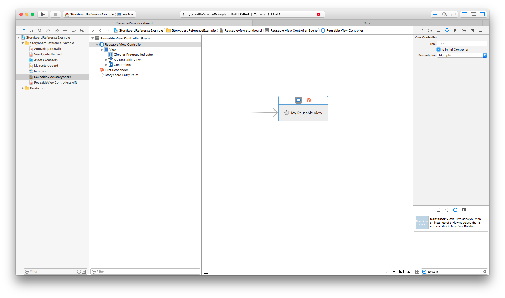
4. In the storyboard view that you wish to embed the reusable view in, add a Storyboard Reference from the library.
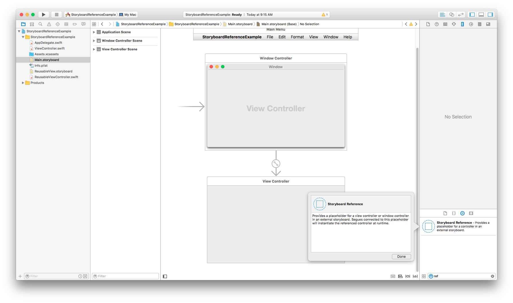
a. Select the Storyboard Reference in the Storyboard, then show the Attributes Inspector (this can be twitchy. When I first added the Storyboard Reference, the Inspector was blank; I had to first select the reference, then select the Quick Help Inspector, then select the other Inspectors in sequence until I got to the Attributes Inspector). Enter the reusable Storyboard ID you created above for the reference.
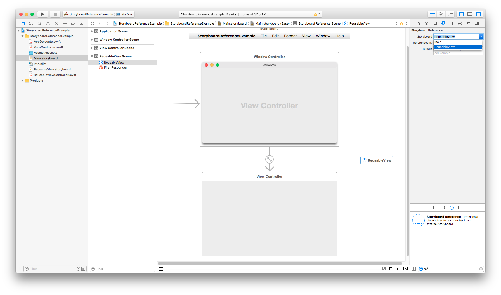
5. Still in the containing storyboard, add a Container View from the library to the view you wish to embed the reusable view in.
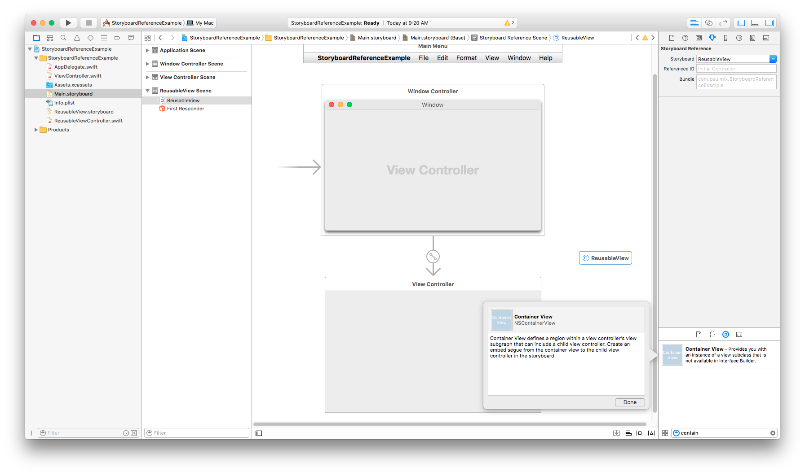
a. Set size and constraints of the Container View appropriately.
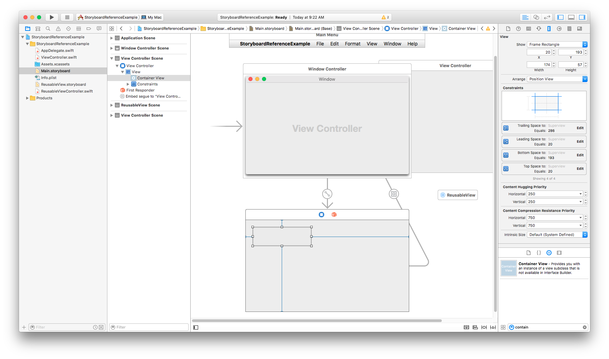
6. When the Container View was added, it automatically created a View Controller to be the target of the Container View's "embed" segue. We don't need this view controller, as we want the Container View to embed the Reusable View.
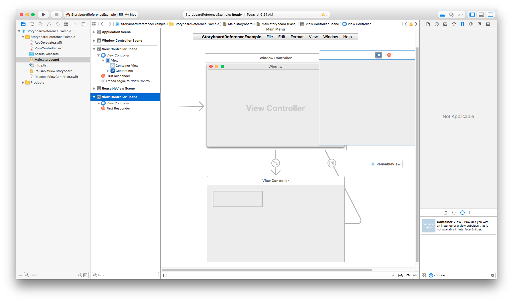
a. Select the View Controller scene that was generated for the Container View and delete it.
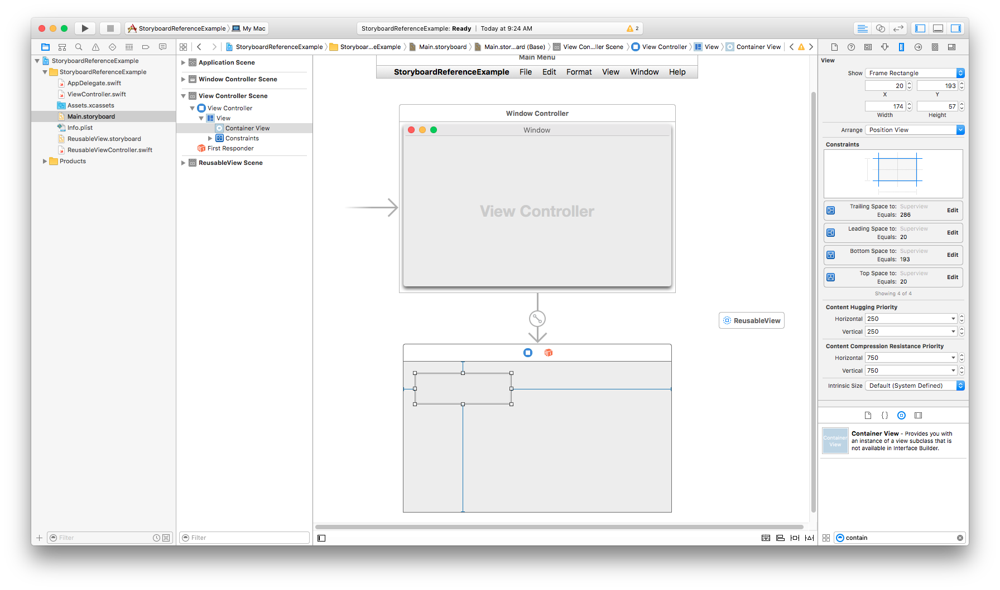
7. Now create a new "embed" segue from the Container View to the reusable view storyboard reference. Control drag from the Container View to the storyboard reference, and select the Embed segue.
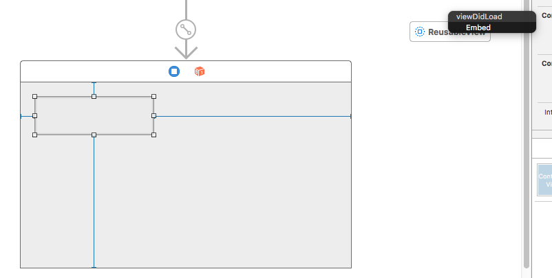
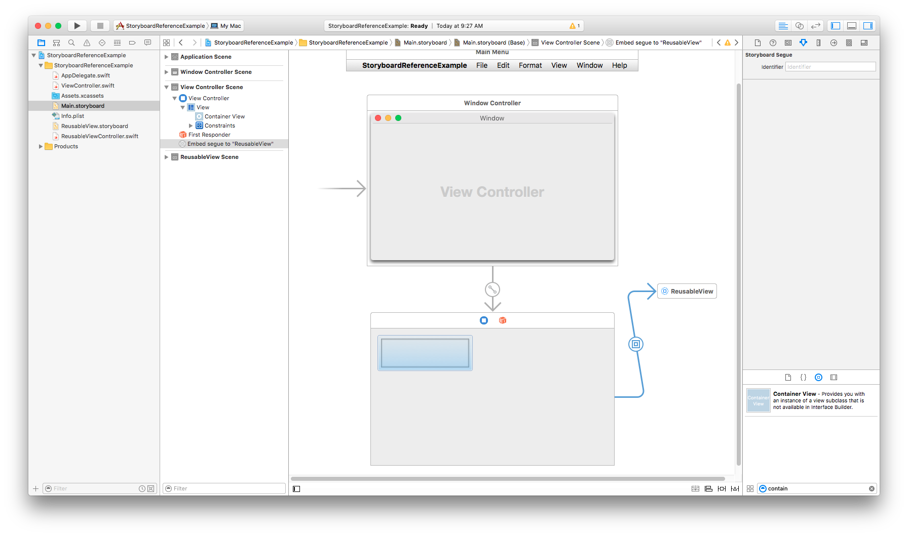
8. Build and run your app. The reusable view should be embedded within the container view.
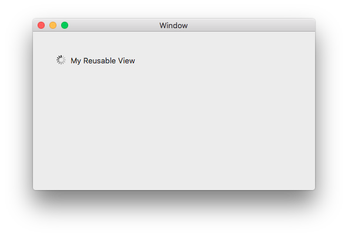

That's it! You'll likely want to tweak constraints to make the embedded reusable view behave as you would like in the parent view.